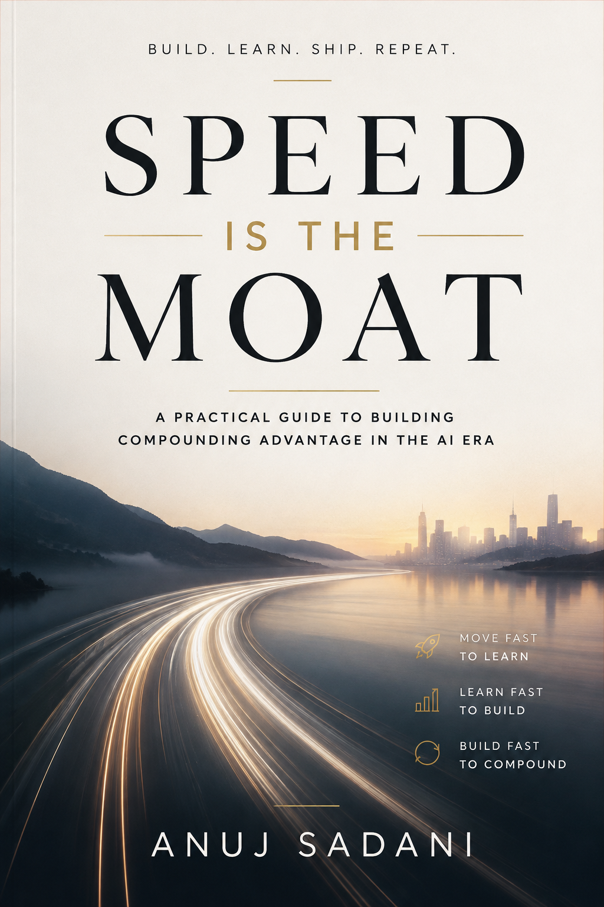

# Speed Is the Moat

<p align="center">
  
</p>

<p align="center">
  <strong><a href="https://tech.anujsadani.in/speed-is-the-moat/">Read online</a></strong>
  &nbsp;&middot;&nbsp;
  <strong><a href="https://ko-fi.com/s/17808b2e0b">Get the PDF on Ko-fi</a></strong>
  &nbsp;&middot;&nbsp;
  <a href="SUMMARY.md">The argument in five minutes</a>
</p>

---

A short book on a claim that circulates in AI engineering: that now token cost is
understood, **inference speed is the next durable advantage** — the moat.

It is not. But the instinct behind it is pointing at something real, and the
useful version turns out to be narrower and more actionable than the slogan.

Twenty-six pages, eight chapters. Every factual sentence is bound to an exact
quotation in a source captured to disk and checked by hash.

## The argument

**Speed is not a moat — it is a lead with a measured half-life of one to two
months.** Independent benchmarks record inference software delivering up to 2x
more throughput on *unchanged silicon* inside a single month. That is shorter
than most procurement cycles, which is the whole problem with the word.

Four findings sit under that:

1. **The dispersion is real and large.** Between providers of *identical* open
   weights, the spread runs five to eight times. Between resellers of a
   proprietary frontier model it collapses to about 1.4x. So the size of the
   prize depends on a structural question, not an engineering one: can you
   choose who serves the weights?

2. **Latency is bought, not won.** It is already a priced contract term.
   Platform documentation carries an explicit Latency SLA column, with defined
   per-model targets on priority and provisioned tiers and none on standard.
   Most organizations sit on the ungoverned tier by default rather than by
   decision.

3. **The interactive business case is contradicted by the only controlled study
   in the corpus.** A CHI 2026 experiment varied time-to-first-token across 2, 9
   and 20 seconds for 240 participants. Behavior did not shift — and 2-second
   responses were rated *less* thoughtful and useful than 9-20-second ones. The
   ubiquitous "100ms = 1% of sales" figure is an e-commerce page-load result
   recycled into AI latency marketing.

4. **Where speed compounds is agentic wall-clock**, not interface
   responsiveness. Agentic traces run tens of sequential turns — up to 200 for
   code QA — with heavy tails at every step.

The phrase "Speed is the moat" appears in this research as a quote from AMD's VP
of GPU Software in a benchmark launch post. Nvidia describes the same benchmark
results in terms of performance per dollar and per megawatt.

## What is in here

| Path | |
|---|---|
| Typeset PDF | The book. 26 pages, typeset A4, full-bleed cover. Sold on [Ko-fi](https://ko-fi.com/s/17808b2e0b); not in this repository. |
| [`index.html`](https://tech.anujsadani.in/speed-is-the-moat/) | The same book on the web. Self-contained — fonts and images embedded, no network needed, prints identically. |
| [`SUMMARY.md`](SUMMARY.md) | The condensed argument and the numbers. |
| [`assets/`](assets/) | Cover art. |
| [`research/`](research/) | The evidence the book is built on. |
| [`LICENSE`](LICENSE) | CC BY 4.0 &mdash; use it freely, credit the author. Does not cover the captured third-party sources. |

## Checking any claim

Every superscript in the book is a claim identifier. It resolves to a row in
[`research/claims.jsonl`](research/claims.jsonl), which names the source and
the exact words relied on. Nothing requires trusting the author, and nothing
requires network access.

Take `c-052`, the finding that faster responses were rated *worse*:

```bash
# the claim, its stance and its confidence
grep '"c-052"' research/claims.jsonl

# the passage it binds to, inside the captured source
grep -n "rated the LLM" research/snapshots/s-024.txt

# proof the snapshot has not changed since capture
sha256sum research/snapshots/s-024.txt
grep '"s-024"' research/sources.jsonl
```

`research/` holds the question and its boundaries as written *before* any source
was read (`brief.md`), the source standard (`lens.yaml`), 33 captured sources
with tiers and caveats (`sources.jsonl` and `snapshots/`), 65 bound claims
(`claims.jsonl`), where the sources agree and conflict (`synthesis.md`), the
underlying report with citation markers (`report.md`), and the verification
gate's verdict (`verification-report.md`).

The gate fails a document when a marker resolves to nothing, when a quotation
does not occur in its snapshot, when a snapshot's hash has changed, or when a
contested claim is presented as settled. It returned **PASS** with zero hard
failures across 65 claims and 33 sources.

## What the book does not establish

- The cross-provider figures rest on a single benchmarker. A second benchmark
  corroborates the shape of the finding, but it measures hardware and serving
  stacks rather than API endpoints.
- The latency experiment covers 2-20 seconds on knowledge tasks. It does not
  settle voice, real-time, or long-horizon agentic interaction.
- Whether buying organizations set and enforce *internal* latency objectives is
  unverified; that needs procurement contracts not obtained here.
- No independent auditor pass was run. Every locator is a mechanical
  quote-match, which catches fabrication but not a quotation that is accurate
  and does not mean what the claim needs.

These are stated in the book as well, in the chapters that depend on them.

## A note on the cover

The cover states the thesis in its popular form — and in its *other* form.
"Build, learn, ship, repeat" is a claim about **organizational velocity**: how
fast a team learns and ships.

The book does not test that claim. It was ruled out of scope in writing before
any evidence was gathered, because the two meanings are so easy to slide
between. What is tested is the narrower, measurable one: that **inference** speed
is a durable differentiator.

So the cover is the proposition and the book is the audit. They are meant to
disagree.
